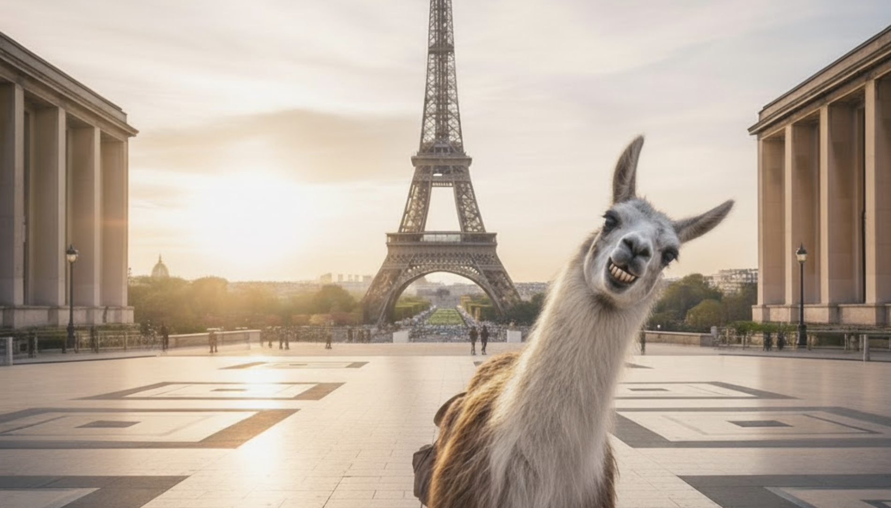

# The Eiffel Tower Llama 

## **Reproducing the Golden Gate Claude demo with open-source models.**

This projects tentatively mimics the [Golden Gate Claude](https://www.anthropic.com/news/golden-gate-claude) experiment with open-source models, and establish a methodology for finding the optimal steering procedure.

We steered **Llama 3.1 8B Instruct** to become obsessed with the Eiffel Tower using **sparse autoencoders (SAEs)**.

<div align="center">
    
</div>

For more information, see the corresponding **[blog post](https://huggingface.co/dlouapre/spaces/eiffel-tower-llama)** on 🤗Hugging Face Spaces.

You can also **[try the demo](https://huggingface.co/dlouapre/spaces/eiffel-tower-llama-demo)**.

## Overview

This repository contains code for:
- Steering LLMs using SAE features from [Neuronpedia](https://www.neuronpedia.org) using `nnsight`;
- Systematic evaluation with LLM-as-a-judge metrics (concept inclusion, fluency, instruction following), calling GPT-OSS on 🤗Inference Providers.
- Bayesian optimization for multi-layer steering coefficients
- Analysis comparing SAE steering to prompt engineering

## Key Findings

- **The steering sweet spot is narrow** - optimal strength is ~0.5x the typical activation magnitude but ensuring concept inclusion without harming fluency and instruction following is tricky.
- **Clamping works better than adding** - clamping activations leads to better results than additive steering. This is consistent with what has been reported for the Golden Gate Claude demo, but contrasts with AxBench findings.
- **More features is not necessarily better** - steering multiple features only yields marginal improvements, suggesting those features are redundant rather than complementary.
- **Prompting still wins** - all in all, careful prompt engineering still outperforms SAE steering in this setup.

## Quick Start

```bash
# Install dependencies
uv sync

# Run 1D parameter sweep, configure in scripts/sweep_1D/sweep_1D.yaml
uv run scripts/sweep_1D/sweep_1D.py

# Evaluate steered model, configure in scripts/evaluation/evaluation.yaml
uv run scripts/evaluation/evaluation.py

# Optimize multi-layer steering, configure in scripts/optimize/optimize_botorch.yaml
uv run scripts/optimize/optimize_botorch.py
```

For using LLM-judge, do not forget to set up your Inference Providers API keys for GPT-OSS calls in `steering.py` or rely on local models.

## Structure

```
src/
  steering.py       # Core steering functions with nnsight
  optimize.py       # Bayesian optimization utilities
scripts/
  sweep_1D/         # Parameter sweep experiments
  evaluation/       # Model evaluation with LLM judges
  optimize/         # Multi-layer optimization
data/
  alpaca_eval.json  # Evaluation prompts from Alpaca
```

## Citation

If you use this work, please cite:
```
Louapre, D. (2025). The Eiffel Tower Llama: Reproducing the Golden Gate Claude
experiment with open-source models.
```

## Related Work

- [Golden Gate Claude](https://www.anthropic.com/news/golden-gate-claude) - Original Anthropic demo
- [Neuronpedia](https://www.neuronpedia.org) - SAE exploration platform
- [AxBench](https://arxiv.org/abs/2501.17148) - Steering benchmark paper
